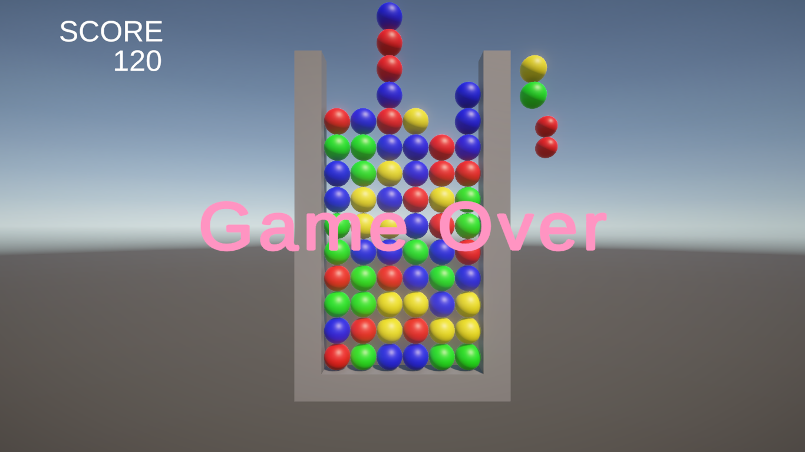
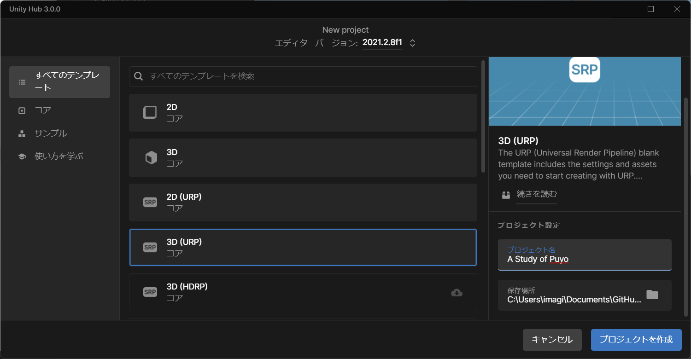
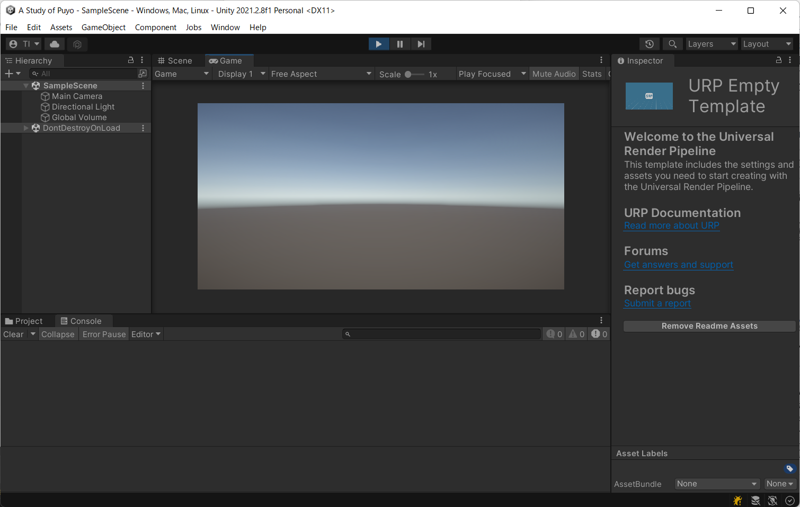
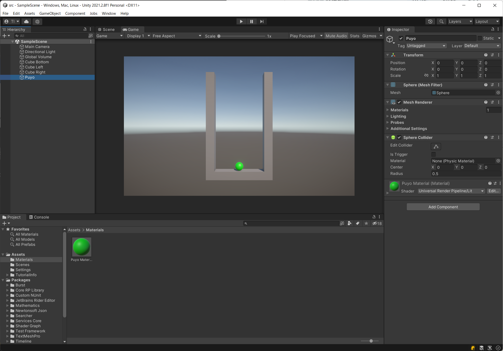

# 概要
ゲーム作りを学ぶために、最初の状態からゲームを作っていきたいと思います。

ここでは、最初にGitHubで管理できるUnityのプロジェクトを作ってみます。

# 手順

## GitHubでプロジェクトを作成する
GitHubでリポジトリを作成する（ローカルでgit initしても良いが、こちらの方が簡単）
- New Repositoryから作成
- README.mdは付けておく(何もないとgit initしなくてはならないので)
- .gitignore はUnityのものを選ぶ

## ローカルにクローン
git管理をローカルでできるようにする。
- GitのクライアントツールやCLIでリポジトリをcloneする

## Unityのプロジェクトの作成
- cloneした場所に作る
  - 今回は、「3D(URP)」を選択
  

- Unityを閉じる
  - 開いたままだと、次の名前変更に失敗する
- Unity のフォルダの名前を「src」に変更する
  - 他のリポジトリで見られる形態
- 「src」フォルダに.gitignoreを移動する
  - 現在のUnity用の.gitignoreがUnityのプロジェクトのルートに置かれることを期待しているので
- 「src」フォルダでUnityのリポジトリを開き直す
  - ディレクトリが変わると開けないので
  -「開く」から開き直す

## Unityのシーンにオブジェクトを配置
今回は、オブジェクトを動かなくても見れるようにはする
- 枠を作ってみる
  - Cube(Cube Bottom): Scale(6,1,1), Position(0,-1,0)
  - Cube(Cube Right):  Scale(1,13,1), Position(3.5,5,0)
  - Cube(Cube Left): Scale(1,13,1), Position(-3.5,5,0)
- ぷよっぽいものをおいてみる
  - Sphereを(0,0,0)に配置(Puyoという名前などにする)
  - Folderを作成(Materials)
  - Materialをmaterials内に作成(Puyo Material)
  - Base Mapの色を緑等にする
  - Material をSphereにD&D

## .gitignoreの編集
Unityのプロジェクトのルートに.girignoreがあることを想定しているので、編集してsrcフォルダにあっても良いように変更する
- フォルダの前に書かれている「/」を削除
- 「[Uu]ser[Ss]ettings/」を追加

## Gitを更新
- 更新したファイルをaddしてcommitしてpush

